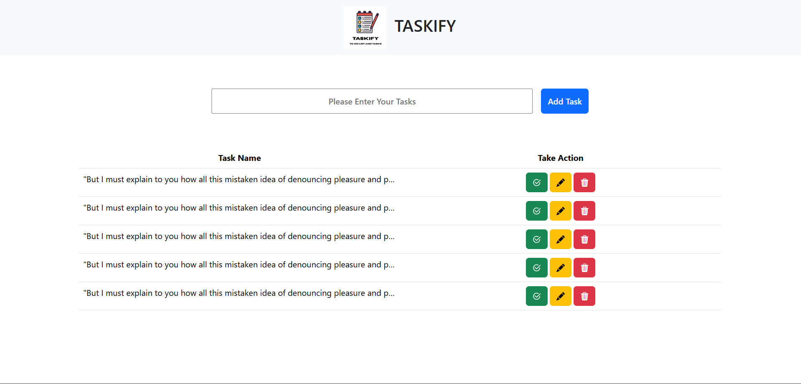

# 📋 Taskify

Taskify is a user-friendly to-do list application built to help you track your tasks and manage your time effectively. 
</br>
You can easily add, edit, and delete tasks to keep your day-to-day activities in check.


### ✨ Features

* **Add Tasks:** Quickly add new tasks with a simple text input.
* **Edit Tasks:** Modify existing tasks with a dedicated edit button.
* **Delete Tasks:** Remove completed or unwanted tasks.
* **Mark as Complete:** Check off tasks as you finish them.

### 📸 App Screenshot




### 🚀 How to Run Locally

To get a local copy of this project up and running, follow these simple steps.

#### Prerequisites
* Node.js (for npm)

#### Installation

1.  Clone the repository:
    ```bash
    git clone [https://github.com/your-username/Taskify.git](https://github.com/your-username/Taskify.git)
    ```
2.  Navigate into the project directory:
    ```bash
    cd Taskify
    ```
3.  Install the required dependencies:
    ```bash
    npm install
    ```
4.  Run the application:
    ```bash
    npm start
    ```
    (or whatever the command is to run your app)

5.  Open your browser and navigate to `http://localhost:3000` (or the port your app runs on).


### 💻 Technologies Used

* **Frontend:**
    * HTML5
    * CSS3
    * JavaScript

* **Backend:**
    * Node.js (if applicable)

* **Package Manager:**
    * npm

### 📄 License

This project is licensed under the MIT License Can be used for educational Purposes.